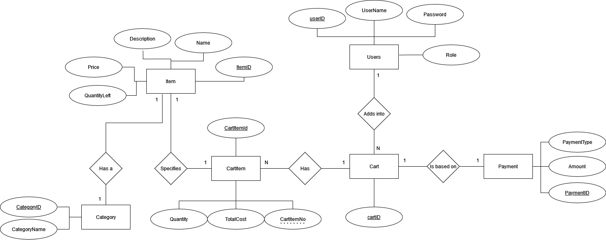

# OdinShopping API

Backend API for OdinShopping web application. These APIs are built using ASP .NET Core Web API and Entity Framework Core.

## Table of Contents

- [OdinShoppingAPI](#project-name)
  - [Table of Contents](#table-of-contents)
  - [Features](#features)
  - [Database Schema](#Database-Schema)
  - [Testing](#testing)

## Feature

- Browse products
- Manage user accounts, including registration and authentication
- Add items into Cart for registered users
- Make payment for registered users
- Print invoice given date range for Admin
- Modify items and categories for Admin

## Database Schema

The following ERD diagram showcases the relationship between tables in OdinShopping:

## Testing

Unit testing is done through XUnit, using FakeItEasy as the Mocking tool. The repository for testing is found here: https://github.com/detectivemerry/odin-shopping-cart-API-tests 

## Built With

- ASP .NET Core Web API 7
- Entity Framework core

